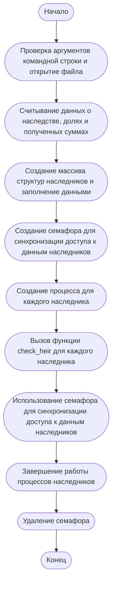

# ИДЗ №2

## Сафаров Сардор Хайрулла угли БПИ212

## Условие 24 варианта:
Задача о наследстве. У старого дона Энрике было два сына, у
каждого из сыновей – еще по два сына, каждый из которых имел
еще по два сына. Умирая, дон Энрике завещал все свое богатство
правнукам в разных долях. Адвокат дон Хосе выполнил задачу
дележа наследства в меру своих способностей. 
Правнуки заподозрили адвоката в укрывательстве части наследства или его некорректном перераспределении. 
Требуется создать приложение,
которое при известных сумме завещания дона Энрике и
доле каждого наследника, проверяет честность адвоката.


---- 

# 4 балла (семафоры System V):

### 1. Приведено решение задачи на C: <br>
> [main_4.c](/4/main_4.c)
### 2. Запуск программы:
Компиляция:
``` shell
gcc -o main_4 main_4.c
```
Запуск:
``` shell
./main_4 input.txt
```
<br>


### 3. Схема:
Сначала происходит проверка аргументов командной строки и открытие файла с входными данными. Из файла считываются данные о наследстве, долях и полученных суммах. Затем создается массив структур наследников и заполняется данными.

Далее создается семафор для синхронизации доступа к данным наследников, и для каждого наследника создается отдельный процесс. В каждом процессе вызывается функция check_heir, которая проверяет правильность распределения наследства для данного наследника. Для обеспечения синхронизации доступа к данным наследников используется семафор.

После завершения работы всех процессов наследников семафор удаляется, и программа завершает свою работу.




----

# 5 баллов (именованные семафоры POSIX):

### 1. Приведено решение задачи на C:

> [main_5.c](/5/main_5.c)

### 2. Запуск программы:
Компиляция:
``` shell
gcc -o main_5 main_5.c
```
<br>

Запуск:
``` shell
./main_5 input.txt
```
<br>

### 3. Схема:

Сначала происходит чтение входных данных из файла, включая наследство, доли наследников и полученные суммы. Затем создается массив структур наследников, каждая структура содержит информацию об одном наследнике.

Далее создается семафор для синхронизации доступа к данным наследников и создаются процессы-наследники, каждый из которых будет проверять свою долю наследства. При создании процессов используется функция fork(). Каждый процесс-наследник вызывает функцию check_heir(), которая проверяет долю наследства для конкретного наследника.

Функция check_heir() начинается с установки зерна для генерации случайных чисел, создания случайной задержки и захвата семафора для синхронизации доступа к данным. Затем функция проверяет долю наследства для конкретного наследника и выводит информацию на экран. После этого функция освобождает семафор.

После того, как все процессы-наследники завершают свою работу, закрывается и удаляется семафор. Затем приложение завершается.


----

# 6 баллов (неименованные семафоры POSIX):

### 1. Приведено решение задачи на C:

> [main_6.c](/6/main_6.c)

### 2. Запуск программы:
Компиляция:
``` shell
gcc -o main_6 main_6.c
```
<br>

Запуск:
``` shell
./main_6 input.txt
```
<br>

### 3. Схема:

Программа создает для каждого наследника отдельный процесс, который выполняет функцию check_heir(). Для синхронизации доступа к общим ресурсам (например, к выводу на экран) используется семафор.

Сначала программа читает данные о наследстве, долях и полученных суммах из входного файла. Далее создается массив структур Heir, каждая структура содержит информацию о наследнике, включая его долю наследства и семафор для синхронизации доступа к общим ресурсам.

Затем создается семафор с помощью функции sem_init(). Значение семафора устанавливается в 1, что позволяет единовременно выполнять один процесс. Для каждого наследника создается отдельный процесс с помощью функции fork(), и выполняется функция check_heir(), которая проверяет правильность распределения наследства. Функция генерирует случайное время ожидания, чтобы создать случайные условия. Затем она захватывает семафор, чтобы предотвратить конкуренцию за общие ресурсы, вычисляет ожидаемую долю, выводит информацию о наследнике и проверяет, соответствует ли ожидаемая доля полученной доле. После этого функция освобождает семафор.

После завершения работы всех процессов-наследников основной процесс вызывает функцию sem_destroy(), чтобы уничтожить семафор.


---- 

# Отчёт 7 баллов (именованные семафоры POSIX):

### 1. Приведено решение задачи на C:

> * [main_7.c](7/main_7.c)
> * [check_heir_7.c](7/check_heir_7.c)


### 2. Запуск программы:
Компиляция:
``` shell
gcc -o main_7 main_7.c
```
<br>

``` shell
gcc -o check_heir_7 main_7.c
```
<br>


Запуск:
1) В одном терминале сначала запустите
``` shell
./main_7 input.txt
```
<br>

2) Во втором терминале запускайте в любом порядке:
``` shell
./check_heir_7 n (где 1 <= n <= 8)
```
### 3. Схема решаемой задачи:

Этот код состоит из двух программ, которые работают с разделяемой памятью и семафорами для обеспечения синхронизации между процессами. Основная идея заключается в том, что первая программа (начало кода) инициализирует разделяемую память и семафор, а вторая программа (конец кода) использует их для проверки данных о наследстве.

Первая программа выполняет следующие шаги:

Читает данные из файла (наследство, доли и полученные суммы) и инициализирует массив структур Heir.
Создает именованный семафор с помощью sem_open().
Создает разделяемую память с помощью shmget().
Присоединяет разделяемую память к адресному пространству процесса с помощью shmat().
Копирует информацию о наследниках в разделяемую память.
Ожидает нажатия клавиши Enter пользователем, после чего отключает разделяемую память, удаляет ее и закрывает семафор.
Вторая программа выполняет следующие шаги:

Открывает семафор с помощью sem_open().
Получает идентификатор разделяемой памяти с помощью shmget().
Присоединяет разделяемую память к адресному пространству процесса с помощью shmat().
Ожидает доступа к разделяемой памяти с помощью sem_wait().
Читает информацию о наследниках из разделяемой памяти, вычисляет ожидаемую долю и сравнивает ее с фактически полученной долей.
Если ожидаемая доля не равна фактически полученной, выводит сообщение о недобросовестном адвокате.
Освобождает доступ к разделяемой памяти с помощью sem_post().
Отключает разделяемую память и закрывает семафор.
Схема работы: первая программа создает разделяемую память и семафор, после чего вторая программа использует их для доступа к данным о наследниках и проверки их долей наследства. Семафоры используются для обеспечения синхронизации доступа к разделяемой памяти между разными процессами.


---- 

# 8 баллов (семафоры System V):

### 1. Приведено решение задачи на C:

> * [main_8.c](/8/main_8.c)
> * [check_heir_8.c](/8/check_heir_8.c)


### 2. Запуск программы:
Компиляция:
``` shell
gcc -o main_8 main_8.c
```
<br>

``` shell
gcc -o check_heir_8 main_8.c
```
<br>


Запуск:
1) В одном терминале сначала запустите
``` shell
./main_8 input.txt
```
<br>

2) Во втором терминале запускайте в любом порядке:
``` shell
./check_heir_8 n (где 1 <= n <= 8)
```
### 3. Схема:

Этот код состоит из двух программ, которые взаимодействуют через разделяемую память и семафор для синхронизации доступа к этой памяти. Основная идея заключается в том, чтобы проверить, получили ли наследники правильные доли наследства.

Первая программа (первый блок кода) выполняет следующие действия:

Чтение данных о наследстве, долях наследников и полученных ими суммах из файла;
Создание разделяемой памяти и запись в неё данных о наследниках;
Создание семафора для синхронизации доступа к разделяемой памяти;
Ожидание нажатия Enter для завершения программы и освобождение разделяемой памяти и семафора.
Вторая программа (второй блок кода) выполняет следующие действия:

Получение индекса наследника из аргументов командной строки;
Получение доступа к разделяемой памяти и семафору, созданным первой программой;
Блокировка семафора для предотвращения одновременного доступа к разделяемой памяти;
Чтение данных о текущем наследнике из разделяемой памяти;
Проверка, совпадает ли ожидаемая доля наследства с фактически полученной. Если нет, выводится сообщение о недобросовестном адвокате;
Разблокировка семафора и отключение от разделяемой памяти.


